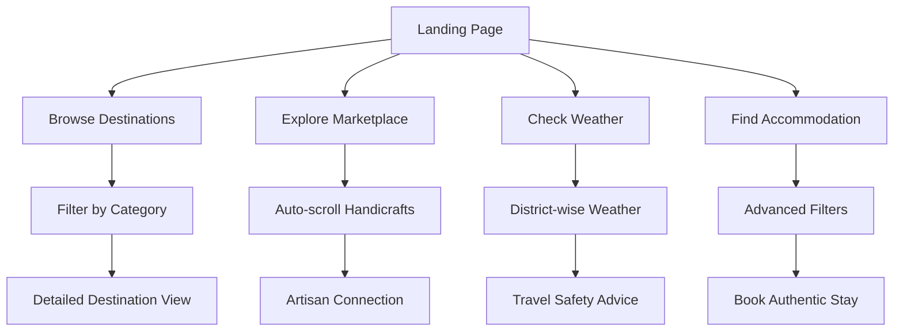

<!-- Banner Image -->
<p align="center">
  
</p>

<h1 align="center">🌿 ROOTSnROUTES: AI-Powered Jharkhand Tourism Platform 🚀</h1>
<p align="center">
  Empowering sustainable, inclusive, and smart tourism in the Heart of India.
</p>

<p align="center">
  
  
  
  
  
</p>

---

## 📖 Overview
**ROOTSnROUTES** is a comprehensive digital tourism platform for Jharkhand, featuring authentic local experiences, AI-powered recommendations, and integrated marketplace for handicrafts and homestays. The platform connects tourists with local communities while promoting sustainable tourism practices.

---

## 👥 Team Members
| Roll No.     | Name        |
|--------------|-------------|
| 2410030170   | Tanish Oberoi |
| 2410030316   | Yash Raj  |
| 2410030304   | Shreesh   |
| 2410030533   | Pakkireddy Nihal Reddy  |
| 2410030020   | Sriya Gayatri  |
| 2410030057   | Kulkarni Sahithi     |

---

## 🌟 Current Features Implemented

### 🏠 **Comprehensive Accommodation System**
- **75+ Authentic Stays** across all 24 districts of Jharkhand
- **Advanced Filtering System** with dropdowns for district, type, rating, and price
- **Multiple Accommodation Types**: Tribal homestays, eco-lodges, heritage hotels, forest guest houses
- **Detailed Property Information**: Amenities, features, host details, cultural experiences

### 🎨 **Local Marketplace Integration**
- **110+ Authentic Handicrafts** from local artisans
- **Auto-scroll Carousel** showcasing diverse tribal crafts
- **Category-based Filtering**: Metal Art & Dokra, Textiles, Folk Art, Basketry, Wood Crafts
- **Direct Artisan Connection** with purchase options

### 🌦️ **Smart Weather Dashboard**
- **Real-time Weather Data** for all 24 districts
- **Travel Safety Indicators** with color-coded alerts
- **3-Column Responsive Layout** with professional dark gradient design
- **Automatic Updates** every few minutes

### 🗺️ **Destination Management**
- **Iconic Destinations Showcase** with high-quality imagery
- **Category Organization**: Waterfalls, Wildlife, Temples, Hills, Heritage sites
- **Interactive Filtering** with accurate counts per category

### 🍽️ **Restaurant & Dining**
- **Professional Filter System** with district, cuisine, rating, and price filters
- **Local Cuisine Focus** highlighting tribal and traditional dishes
- **Comprehensive Coverage** across major districts

### 🌐 **Multi-language Support**
- **English & Hindi** interface with complete translations
- **Cultural Context** preserved in both languages
- **Seamless Language Switching**

---

## 🛠 Tech Stack  

| Category | Technology | Implementation |
|----------|------------|----------------|
| **Frontend** | React 18 + TypeScript | ✅ Full SPA with type safety |
| **Styling** | Tailwind CSS + shadcn/ui | ✅ Modern component library |
| **Build Tool** | Vite | ✅ Fast development & production builds |
| **Routing** | React Router v6 | ✅ Client-side routing with refresh support |
| **State Management** | React Context API | ✅ Theme, language, auth contexts |
| **Backend** | Supabase | ✅ Database, auth, real-time features |
| **Icons** | Lucide React | ✅ Consistent iconography |
| **Animations** | Framer Motion | ✅ Smooth transitions and interactions |
| **Maps** | Google Maps Integration | 🔄 Ready for implementation |

---

## 🔄 User Journey Flow



---

## 🏗️ Current Architecture

### **Component Structure**
```
src/
├── components/
│   ├── Header.tsx              # Navigation with language toggle
│   ├── Footer.tsx              # Organized link sections
│   ├── Marketplace.tsx         # Auto-scroll handicrafts showcase
│   ├── WeatherCard.tsx         # District weather display
│   └── ui/                     # Reusable UI components
├── pages/
│   ├── AuthenticStays.tsx      # 75+ accommodations with filtering
│   ├── Destinations.tsx        # Iconic locations showcase
│   ├── Restaurants.tsx         # Dining options with filters
│   ├── WeatherDashboard.tsx    # Real-time weather data
│   └── Marketplace.tsx         # Full marketplace experience
├── contexts/
│   ├── ThemeContext.tsx        # Dark/light theme
│   ├── LanguageContext.tsx     # Multi-language support
│   └── AuthContext.tsx         # User authentication
└── hooks/
    ├── useResponsive.tsx       # Responsive design utilities
    └── useLanguage.tsx         # Translation utilities
```

---

## 📊 Platform Statistics

| Feature | Count | Coverage |
|---------|-------|----------|
| **Accommodation Listings** | 75+ | All 24 districts |
| **Handicraft Products** | 110+ | 8 major categories |
| **Weather Stations** | 24 | Complete state coverage |
| **Destination Categories** | 9 | Comprehensive tourism types |
| **Languages Supported** | 2 | English + Hindi |
| **Filter Options** | 20+ | Advanced search capabilities |

---

## 🚀 Deployment & Performance

### **Production Ready Features**
- ✅ **Client-side Routing** with refresh support
- ✅ **PWA Ready** with service worker configuration
- ✅ **SEO Optimized** with proper meta tags
- ✅ **Performance Optimized** with lazy loading
- ✅ **Mobile Responsive** across all screen sizes

### **Deployment Configuration**
```bash
# Development
npm run dev          # Start development server

# Production
npm run build        # Create optimized build
npm run preview      # Preview production build

# Deployment ready for:
# ✅ Netlify (netlify.toml included)
# ✅ Vercel (auto-detected)
# ✅ Static hosting platforms
```

---

## 💡 Key Innovations

### **🎯 Smart Filtering System**
- Dropdown-based filters matching modern UX patterns
- Dynamic count updates based on available data
- Multi-level filtering (district + type + rating + price)

### **🎨 Cultural Authenticity**
- Real tribal homestay experiences with family interactions
- Authentic handicraft marketplace with artisan stories
- Traditional accommodation types (Dokra workshops, Santhal heritage homes)

### **📱 Responsive Excellence**
- Auto-scroll carousels for mobile optimization
- Progressive disclosure of information
- Touch-friendly interfaces across all components

### **🌍 Sustainability Focus**
- Eco-lodge promotion and forest conservation awareness
- Direct artisan support through marketplace integration
- Community-based tourism model

---

## 🔮 Roadmap & Future Enhancements

### **Phase 1: Core Platform Enhancement** (Current)
- [x] Advanced filtering systems
- [x] Weather integration
- [x] Marketplace auto-scroll
- [x] Multi-language support

### **Phase 2: AI Integration** (Next 3 months)
- [ ] AI trip planner with personalized recommendations
- [ ] Chatbot for instant tourist assistance
- [ ] Smart weather-based activity suggestions
- [ ] Predictive booking recommendations

### **Phase 3: Advanced Features** (6 months)
- [ ] AR/VR virtual tours of destinations
- [ ] Real-time booking system with payment integration
- [ ] Mobile app development (React Native)
- [ ] IoT integration for smart tourism spots

### **Phase 4: Ecosystem Expansion** (12 months)
- [ ] Blockchain-based guide verification
- [ ] Advanced analytics dashboard for tourism officials
- [ ] Integration with government tourism databases
- [ ] Expansion to neighboring states

---

## 🏆 Impact & Vision

### **Current Achievements**
- 🎯 **Complete Digital Catalog** of Jharkhand's tourism offerings
- 🌐 **Seamless User Experience** across all device types
- 🏪 **Direct Artisan Support** through integrated marketplace
- 📊 **Data-Driven Insights** for tourism planning

### **Long-term Vision**
- 🚀 **100,000+ Tourist Engagements** annually
- 🤝 **1,000+ Local Artisan Partnerships**
- 🌱 **Carbon-Neutral Tourism** promotion
- 📈 **25% Increase** in state tourism revenue

---

## 🔧 Getting Started

```bash
# Clone the repository
git clone https://github.com/yashraj24007/ROOTSnROUTES.git

# Install dependencies
cd ROOTSnROUTES
npm install

# Start development server
npm run dev

# Access the platform
open http://localhost:5173
```

---

## 📞 Contact & Support

- **Email**: [team@rootsnroutes.in](mailto:team@rootsnroutes.in)
- **GitHub**: [ROOTSnROUTES Repository](https://github.com/yashraj24007/ROOTSnROUTES)
- **Live Demo**: [Visit Platform](https://rootsnroutes.netlify.app)

---

<p align="center">
  <strong>🌿 Discover. Experience. Connect. 🚀</strong><br>
  <em>Your gateway to authentic Jharkhand experiences</em>
</p>

<p align="center">
  Made with ❤️ for Smart India Hackathon 2024
</p>
